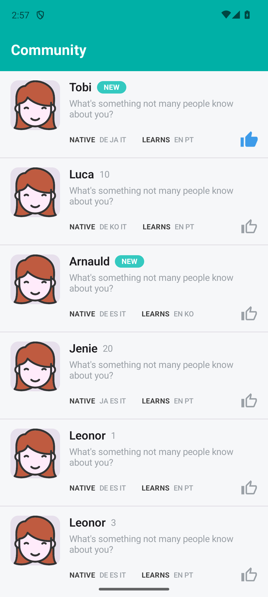
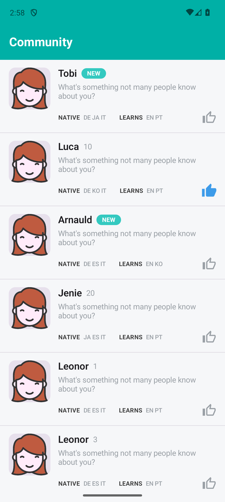

# Language Learning Community

Android app that loads community members from the API, shows them in a list, and lets you like people with a thumbs-up. Likes are saved locally and stay after you close the app.

## What it does

- Fetches pages from `https://tandem2019.web.app/api/community_{page}.json` (20 members per page)
- Scrolls to load more until the last page (Paging 3)
- Shows a `NEW` badge when `referenceCnt` is 0, otherwise shows the count
- Tap the thumbs-up to like/unlike — state is stored in Room

## Screenshots

**Default list**



**After liking a member (Luca)**



## Tech

- Kotlin, Jetpack Compose, Coroutines + Flow
- Paging 3 (`CommunityPagingSource` + `LazyPagingItems`)
- Retrofit + Moshi for the API
- Room for liked members
- Hilt for DI
- Coil for images

## Project structure

Clean architecture with MVVM:

```
data/        → API, Room, PagingSource, repository impl, DTOs, mappers
domain/      → models, repository interface, use cases
presentation/→ ViewModel, Compose UI
di/          → Hilt modules
```

Paging 3 loads pages as you scroll. Likes come from Room and are applied in the UI so paging doesn't restart when you tap thumbs-up.

## Build & run

Needs JDK 17 and Android SDK 34.

```bash
./gradlew assembleDebug
./gradlew installDebug
```

Or open the project in Android Studio and hit Run.

Debug APK: `apk/community-debug.apk`

## Tests

```bash
./gradlew testDebugUnitTest
```

17 unit tests — PagingSource, mappers, repository, use cases, ViewModel.

## Notes

- Likes are a simple Room table — row exists = liked.
- Min SDK 26 (adaptive icons).
- The API returns the same profile picture for everyone. That's the sample data, not a bug.
